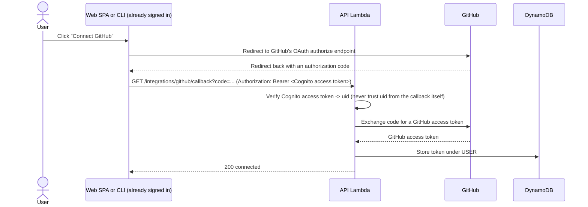

## What is Amazon Cognito?

A managed identity service — it issues, verifies, and rotates tokens so the application doesn't have to write or run any of that itself. Two pieces matter most:

- **User Pool** — holds user identities, handles sign-up/sign-in, issues tokens.
- **Hosted UI** — a ready-made login page Cognito can serve for a User Pool, so no custom login form has to be built. It's most useful when a User Pool federates an external identity provider, since Hosted UI is what actually brokers that provider's OAuth/OIDC redirect. **This project doesn't use it** — see below.

## Tokens Cognito issues

- **ID token** — a JWT describing who the user is (claims like `sub`, email, custom attributes). Meant for the client to read, not for authorizing API calls.
- **Access token** — a JWT the client sends to the API on every request. Short-lived, scoped to what the User Pool grants.
- **Refresh token** — long-lived, used to get new ID/access tokens without making the user log in again. Cognito owns its rotation and revocation entirely — an application built on Cognito never signs a token, never stores a refresh token, and never re-verifies a signature itself.

## Signing in without Hosted UI: `InitiateAuth` and SRP

A User Pool app client can be called directly from a client's own code instead of redirecting to Hosted UI — this is what lets a login screen be fully custom-built. The recommended auth flow for a public client (no client secret, like a browser SPA or a CLI) is **`USER_SRP_AUTH`**, using the Secure Remote Password protocol:

```mermaid
sequenceDiagram
    actor User
    participant Client as Web SPA or CLI (custom UI)
    participant Cognito as Cognito User Pool

    User->>Client: Enter username + password
    Client->>Cognito: InitiateAuth(USER_SRP_AUTH, username, A)
    Cognito-->>Client: Challenge (salt, server public value B, secret block)
    Client->>Client: Derive shared key from password locally; compute proof
    Client->>Cognito: RespondToAuthChallenge(PASSWORD_VERIFIER, proof)
    Cognito-->>Client: ID token + access token + refresh token
```

SRP's point: the password itself never crosses the network in any form, even under TLS — only values derived from it, and only someone who already knows the password can produce a valid proof. Cognito also supports a simpler `USER_PASSWORD_AUTH` flow that does send the password directly (over TLS) for verification, which is easier to implement but a strictly weaker guarantee; it must also be explicitly enabled on the app client, since SRP is the default. Either flow ends the same way: the client walks away with the same three tokens Hosted UI's redirect would have produced, without ever leaving the app or opening a browser tab.

## API Gateway's Cognito JWT authorizer

Rather than writing middleware to verify token signatures, API Gateway can be configured with a **Cognito JWT authorizer**: it fetches Cognito's public signing keys (JWKS), validates every incoming request's access token *before* the request reaches the Lambda, and rejects invalid or expired tokens with a 401 automatically. Application code never sees a request that failed verification, and it never re-checks the signature itself — it just trusts the claims the authorizer forwards.

## Federating an external identity provider (and why this project doesn't)

A User Pool *can* let users log in via an external provider instead of (or alongside) a Cognito-native password. Two shapes that takes:

1. **Standards-based federation (OIDC or SAML)** — the User Pool trusts the external provider's discovery document and public keys directly; this is what "Login with Google" usually is. **GitHub doesn't support this** — it doesn't publish an OIDC discovery document, so it can't be registered as a Cognito OIDC (or SAML) provider out of the box.
2. **Native accounts + Lambda triggers** — the User Pool doesn't federate at the protocol level at all. The application runs its own OAuth2 exchange against the external provider's (non-OIDC) endpoints, and a Cognito **Lambda trigger** links that verified external identity to a native Cognito user account.

Either shape routes login itself through the external provider, which only makes sense if *every* user is expected to authenticate that way. This project's users don't have to — Cognito native accounts are sufficient identity on their own, and GitHub access is only useful to a subset of users for a specific feature (reading their repos), not as a way to prove who they are. Treating GitHub as an **optional connected account** instead of an identity provider sidesteps needing either shape at all: no Lambda trigger, no OIDC-shim service, and no dependency on GitHub being reachable just to sign in.

### The connected-account pattern

This is the same shape as "Connect your Slack workspace" or "Connect your Stripe account" in any SaaS product — a normal OAuth2 authorization-code exchange the *application* runs against the third party's API, completely outside Cognito, available only to a user who is already signed in:



The Cognito access token in step 4 is what ties the GitHub connection to the right user — the callback itself carries no trustworthy identity, only a code.

## Where this project's actual decision lives

Everything above is how Cognito behaves in general, independent of this project. The specific decisions — native `InitiateAuth`/SRP over Hosted UI (ADR 017), and GitHub as an optional connected account rather than a federated identity provider (ADR 016, superseding ADR 015's Lambda-trigger approach) — live in `architecture.md` §12. The day-to-day rules for building against it live in `AGENTS.MD`'s Auth rules section. This file is background reading, not the source of truth for what to build.
