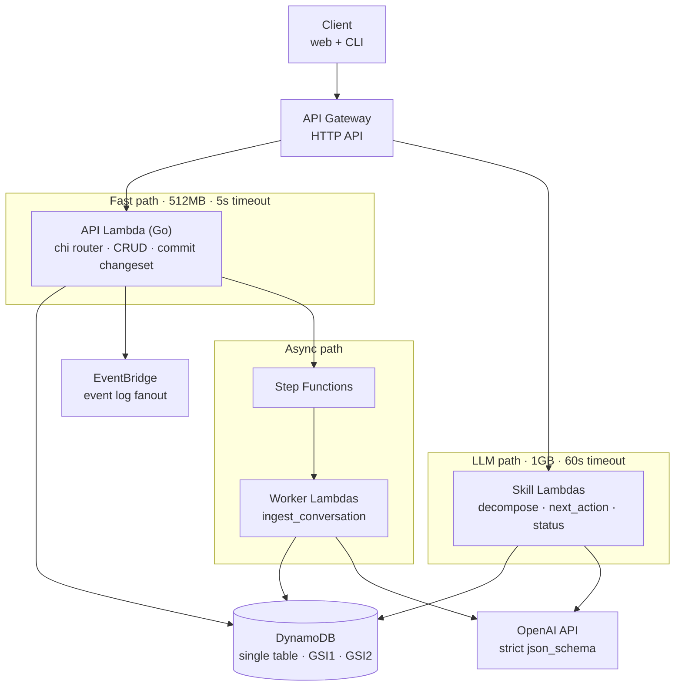
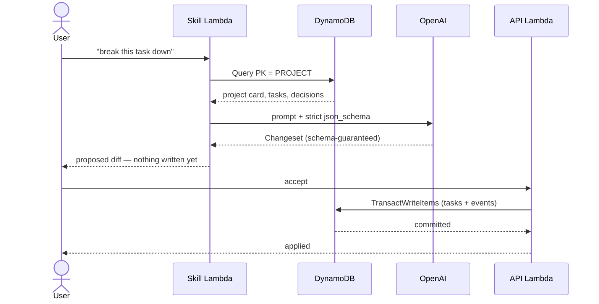

# Nudge — Architecture Decisions

**Product:** An assistant that helps indie developers actually ship things. Breaks big tasks into small ones, adds clarity, maintains context.

**Status:** Pre-implementation. Decisions below cover the POC and MVP.

---

## Architecture at a glance



Every compute node runs **outside the VPC** — DynamoDB over its public endpoint with IAM auth, OpenAI over the public internet. No NAT Gateway anywhere in this picture, which is deliberate (see §9).

The agent core — context assembler, skill router, changeset applier — is not a deployed component. It's shared Go packages compiled into whichever Lambda needs them.

---

## 1. Domain model

Five entities carry every use case.

| Entity | Purpose |
|---|---|
| `Project` | Goal, stack, constraints, status. The "project card" injected into every prompt. |
| `Task` | Tree-shaped via `parent_id`. Status, order, acceptance criteria. |
| `Decision` | An ADR: context, choice, rationale, date. |
| `Event` | Append-only log of everything that happened. |
| `Note` | Raw conversation material not yet turned into tasks or decisions. |

**Rationale:** All six use cases are reads or writes over these five. The `Event` log is what makes "update the project with the conversation" tractable and gives a project journal for free.

---

## 2. The LLM never writes to the datastore

Every skill returns a **proposed changeset** — "create these 5 subtasks, mark task 12 blocked, add this decision." The UI renders it as a reviewable diff. Only an explicit user accept commits it.

**Rationale:** Turns model non-determinism into a UI problem instead of a data-corruption problem. Gives trust, undo, and an audit trail as a side effect.



Note the two separate round trips. Proposal is a read-only operation on the LLM path; commit is a write on the fast path. That split is why the Lambdas divide the way they do in §11.

---

## 3. Hybrid determinism — code for facts, LLM for language

Two use cases are explicitly **not** pure LLM calls:

- **"Where are we?"** — compute counts, stale tasks, blocked tasks, days since activity in Go. Hand the model the computed summary and ask it to narrate. Same numbers every time.
- **"What should I do next?"** — compute the candidate set deterministically (unblocked, dependency-ordered, in-progress first), then let the model rank the top 5 and explain why. A ranking layer rejects any task the model invents.

---

## 4. Skills are a uniform abstraction

```go
type Skill interface {
    Name() string
    BuildContext(ctx context.Context, projectID string) (Context, error)
    ResponseFormat() openai.ResponseFormatJSONSchemaParam  // the changeset shape
    Tools() []openai.ChatCompletionToolParam              // context retrieval only
    Parse(raw json.RawMessage) (Changeset, error)
}
```

Note the split: the **output** shape is a `json_schema` response format, while **tools** are reserved for context retrieval (`get_task_tree`, `search_decisions`). Keeping those separate is cleaner than overloading tool calls to carry the result.

Six skills map to the six use cases: `create_project`, `decompose_task`, `project_status`, `next_action`, `log_decision`, `ingest_conversation`.

**Rationale:** Adding a seventh becomes one new file, not new plumbing.

---

## 5. Context assembly is tiered, not stuffed

- **Always injected:** project card, active tasks, last N decisions.
- **Exposed as tools:** `get_task_tree`, `search_decisions`, `get_task_history` — the model pulls what it needs.

**No vector search.** A project is a few hundred items; retrieval-as-tools is sufficient and simpler.

---

## 6. Platform: AWS + Go

Chosen for familiarity. Go is a good fit regardless — 50–100ms cold starts, small binaries, and structured outputs map cleanly onto typed structs.

### LLM provider: OpenAI

Access via the official `github.com/openai/openai-go`.

**Structured outputs via `response_format: { type: "json_schema", strict: true }`**, not tool use. Strict mode guarantees the response conforms to the schema, which is a stronger contract than validating tool arguments after the fact — the changeset either matches the struct or the call fails.

Generate the schema from Go structs with `invopop/jsonschema`, but **post-process it for strict mode**:

- `additionalProperties: false` on every object
- every property listed in `required` — no genuinely optional fields
- optionality is expressed as a nullable union (`["string", "null"]`), not by omission
- no `anyOf` at the schema root

Write that post-processing once as a helper; every skill reuses it.

**Prompt ordering matters for cost.** OpenAI caches prompt prefixes automatically for prompts over ~1024 tokens. Put the stable content first — system prompt, then the project card — and the variable content (the user's question, recently changed tasks) last. Since the project card goes into every single call, this is close to free savings if the ordering is right and worthless if it isn't.

Pick specific models at implementation time rather than fixing them here; use a small cheap model for routing and summarization and a larger one for decomposition and next-action ranking.

---

## 7. Datastore: DynamoDB, single table, GSIs only

**Decision:** Single-table DynamoDB. **Global** secondary indexes. **No LSIs.**

**Why not LSIs:** They must be defined at table creation and can never be added, removed, or altered. The schema will change several more times before it settles. GSIs are additive against a live table, which removes the premature-lock-in risk entirely.

**Why DynamoDB over Postgres:** A project is a *bounded working set* — a few hundred items, well under the 1MB Query page. `PK = PROJECT#<id>` pulls everything in one round trip, and all filtering, ranking, and aggregation happens in Go over an in-memory slice. That removes the two usual objections: no `GROUP BY` needed, and no materialized paths needed (re-parenting is a single `UpdateItem` on `parent_id`, since the tree is assembled in Go anyway).

It also fits Lambda better than anything else: no VPC, no connection pooling, no cold-resume, IAM auth instead of secrets, genuine per-request billing.

### Key schema

| | PK | SK |
|---|---|---|
| Base | `PROJECT#<id>` | `META` / `TASK#<uuid>` / `DECISION#<ts>` / `EVENT#<ts>` |
| GSI1 | `USER#<id>` | `<updated_at>` |
| GSI2 (sparse) | `PROJECT#<id>` | `<priority>#<updated_at>` |

**GSI2 is sparse on purpose.** Only write its key attributes when a task is actionable (unblocked, not done). "What should I do next?" becomes a single Query against a pre-ordered candidate set, and marking a task blocked or done drops it from the index automatically.

### Constraints to respect

- Each GSI an item projects into is a **separate billed write**. Three indexes ≈ 3–4x write cost. Don't add indexes casually.
- `TransactWriteItems` caps at **100 items**. The changeset applier can exceed this on a large conversation ingestion — chunk it, and make chunks idempotent.

---

## 8. Store sits behind a `Repository` interface

Not because a swap is likely — because a Postgres implementation is ~100 lines and gives a local dev target that can be queried freely with psql while DynamoDB runs in staging.

---

## 9. Lambda stays outside the VPC

**Rationale:** A Lambda inside a VPC loses default internet access and can't reach `api.openai.com` without a NAT Gateway — roughly $32/month before serving a single request. DynamoDB is reached over its public endpoint with IAM auth, so no VPC is needed at all. This constraint is a large part of why DynamoDB wins over Aurora here.

---

## 10. No token streaming in the MVP

Response streaming only works on Lambda Function URLs, and the Go runtime has no first-class support — it means writing against the Runtime API directly.

**Not needed:** Nudge's outputs are structured changesets rendered as a reviewable diff, not chat prose. Return complete JSON, show a skeleton in the UI.

**If needed later:** add one Fargate service for that single endpoint rather than contorting the whole API.

---

## 11. Split Lambdas by resource profile, not per route

**Decision:** 3–4 functions total.

- **API Lambda** — 256–512MB, short timeout. All CRUD: create project, list tasks, apply an approved changeset, log a decision. Dozens of routes behind a `chi` router via `awslabs/aws-lambda-go-api-proxy`. One binary, one warm pool.
- **LLM Lambdas** — 1GB, generous timeouts, own concurrency limits and IAM roles. Anything that calls OpenAI: `decompose`, `next_action`, `ingest`.

**Why not function-per-route:** The cold-start argument is a Node/Python/Java concern; Go binaries start fast regardless. Splitting also *fragments the warm pool* — twelve functions each get a trickle of traffic and each go cold independently. Plus: one atomic deploy, and local dev is a plain `go run` with a debugger attached.

**Why not a single lambdalith either:** A single function must be sized for its worst case, so every cheap Dynamo read gets billed at 1GB. And one slow LLM route saturating the concurrency pool would starve cheap reads. Resource profile is the real seam; the LLM boundary is where profiles diverge.

---

## 12. Long-running work goes to Step Functions

Conversation ingestion and large decompositions run as Step Functions workflows with worker Lambdas. Retries, timeouts, and state machine handling come free. EventBridge carries the event log; SQS carries work.

---

## 13. Infrastructure

- **API:** API Gateway HTTP API (not REST API — cheaper, simpler).
- **Runtime:** Lambda on `provided.al2023`.
- **IaC:** SAM or Terraform.

---

## POC scope

Deliberately none of the above.

One `main.go`, `lambda.Start`, a Function URL, no datastore, one skill (`decompose_task`).

The original plan was a discriminated union at the root, but **strict mode disallows `anyOf` at the schema root**. Model it as a single object with nullable branches instead, and discriminate on `status` in Go:

```json
{
  "status": "ok" | "needs_clarification",
  "subtasks": [...] | null,
  "questions": [...] | null
}
```

Both fields stay in `required`; the unused one is explicitly `null`. This pattern will recur across every skill, so settle it here.

**The only goal is to find out whether the `Task` struct has the right fields.** Everything else gets built once that answer stops changing.

---

## MVP build order

1. Persistence + the project card
2. `project_status` and `next_action` — deterministic-first, so they're trustworthy immediately
3. `log_decision`
4. `ingest_conversation` — last, since it's the fuzziest and benefits from the rest existing

---

## Open questions

- **Auth.** Cognito is the AWS-native answer but unpleasant. Clerk or WorkOS are easier. A CLI client may want API keys plus JWT verification in a Lambda authorizer.
- **IaC choice.** SAM vs Terraform not settled.
- **Cost trigger for revisiting the datastore.** Not defined yet.