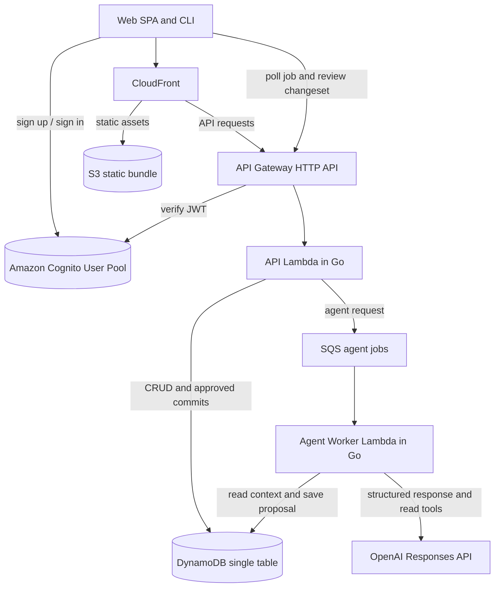
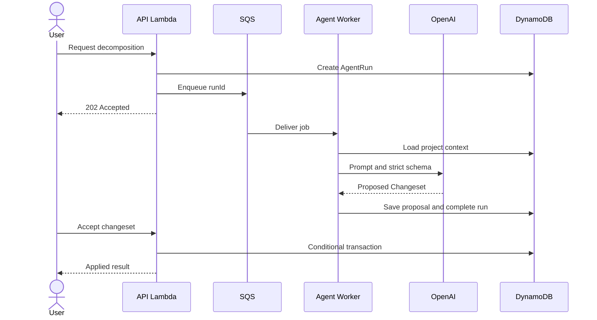

# Nudge Architecture Decisions

**Product:** An assistant that helps indie developers finish projects by breaking large work into small tasks, preserving context and recommending a concrete next action.

**Status:** Pre-implementation

**Scope:** Proof of concept and MVP

**Revision:** 2.3 · 21 September 2026

---

## Architecture at a glance



All compute runs outside a VPC. DynamoDB is accessed with IAM authorization and OpenAI through outbound internet access. The MVP does not require a NAT Gateway. Amazon Cognito is the sole identity and token provider; API Gateway validates every request with a Cognito JWT authorizer before it reaches the API Lambda. GitHub is not part of this diagram — it is an optional, per-user integration a client reaches only after authenticating, not an identity provider (§12).

The agent core is a set of shared Go packages compiled into the Agent Worker. It contains the context assembler, skill registry, deterministic selectors, changeset validator and provider adapter. It is not deployed as an independent service.

---

## 1. Primary architecture decision

The LLM never writes directly to the datastore.

Every skill produces a proposed `Changeset`. The UI or CLI shows the proposal as a reviewable diff. Only an explicit user acceptance allows the API to commit it.



This boundary turns model uncertainty into an explicit product interaction. It also provides auditability, conflict detection and a natural place to implement undo.

---

## 2. Scope

### Proof of concept

The POC contains:

- One Go program.
- One `decompose_task` skill.
- One OpenAI Responses API request.
- One strict structured output schema.
- No authentication.
- No database.
- No asynchronous infrastructure.

Its only goal is to determine whether the initial `Task` and `Changeset` structures represent useful decompositions.

### MVP

The MVP contains:

- Project and task persistence.
- Cognito-based sign-up and sign-in, with a custom-built UI, for the web application and CLI.
- Optional per-user GitHub connection for features that need GitHub API access.
- Project status and next-action recommendations.
- Task decomposition.
- Decision logging.
- Conversation or note ingestion.
- Review and acceptance of proposed changesets.
- Asynchronous agent jobs through SQS.
- Polling for job status.
- Basic usage, quality and reliability metrics.

### Outside the MVP

- Token streaming and WebSocket connections.
- Multi-agent orchestration.
- Collaborative projects.
- Direct repository modifications.
- Calendar, email or issue-tracker mutations.
- A dedicated vector database.
- Long-running Step Functions workflows.
- EventBridge fanout without a concrete subscriber.

---

## 3. Domain model

Seven entities cover the initial use cases.

| Entity | Purpose |
| --- | --- |
| `Project` | Goal, stack, constraints, status, definition of done and current version. |
| `Task` | Tree-shaped work item with status, ordering, dependencies and acceptance criteria. |
| `Decision` | Recorded context, selected option, rationale and date. |
| `Note` | Raw user material or conversation not yet converted into structured project state. |
| `Changeset` | Proposed mutations, base project version, lifecycle and validation result. |
| `AgentRun` | Execution state, selected skill, attempts, timing, model usage and errors. |
| `Event` | Append-only record of accepted project changes. |

`Changeset` and `AgentRun` are explicit entities because proposal generation and proposal acceptance happen in separate requests and can fail independently.

### Changeset lifecycle

```text
proposed -> accepted -> applying -> applied
        \-> rejected
        \-> expired
        \-> conflict
        \-> failed
```

### AgentRun lifecycle

```text
queued -> running -> completed
                  \-> failed
                  \-> cancelled
```

The user-facing job status is derived from `AgentRun`. The durable proposal is stored as a `Changeset`; it is not kept only in browser state.

---

## 4. Hybrid determinism

Nudge uses application code for facts and the LLM for interpretation or language.

### Project status

Go computes:

- Counts by task status.
- Blocked and stale tasks.
- Days since the latest accepted change.
- Progress against the definition of done.
- Open decisions or missing constraints.

The LLM receives those facts and produces a concise explanation. It cannot change the computed values.

### Next action

Go constructs the eligible candidate set:

- Exclude completed and blocked tasks.
- Enforce dependencies.
- Prefer already-started work when appropriate.
- Apply explicit priority and recency rules.

The LLM ranks a small candidate set and explains its choice. The parser rejects any task identifier outside the candidate set.

This separation makes the behavior testable and prevents the model from inventing project facts.

---

## 5. Skills

Skills are application-level strategies executed by the Agent Worker. They are not separate Lambdas.

```go
type Skill interface {
    Name() string
    BuildContext(ctx context.Context, projectID string) (Context, error)
    OutputSchema() map[string]any
    ReadTools() []ToolDefinition
    Validate(result []byte, snapshot ProjectSnapshot) (Changeset, error)
}
```

Initial skills:

| Skill | Result |
| --- | --- |
| `create_project` | Proposed project card and initial milestones. |
| `decompose_task` | Proposed subtasks and acceptance criteria. |
| `project_status` | Structured status report with deterministic facts. |
| `next_action` | Ranked existing task and explanation. |
| `log_decision` | Proposed decision record. |
| `ingest_conversation` | Proposed tasks, decisions and notes extracted from source text. |

Adding a skill requires a new implementation and schema, not a new deployment unit.

---

## 6. OpenAI integration

Nudge uses the official Go SDK and the Responses API behind a provider interface.

```go
type ModelProvider interface {
    GenerateChangeset(ctx context.Context, req GenerateRequest) (GenerateResult, error)
}
```

### Structured output and tools

Use both mechanisms for different jobs:

- `text.format` with `json_schema` and `strict: true` defines the final `Changeset` returned by the model.
- Function calling exposes read-only context operations such as `get_task_tree`, `search_decisions` and `get_task_history`.
- The MVP exposes no mutating tool to the model.

Strict schemas follow these rules:

- `additionalProperties: false` on every object.
- Every property appears in `required`.
- Optional values use nullable unions.
- Unsupported schema constructs are removed by a shared schema-normalization helper.

The application still performs semantic validation. Schema conformance does not prove that a task ID exists, a dependency is valid or a mutation is permitted.

### Model selection

Model names remain configuration rather than architecture constants. Initial evaluation should compare at least:

- Correct changeset structure.
- Correct task references.
- Quality of decomposition.
- Next-action usefulness.
- Latency.
- Input and output tokens.
- Cost per accepted proposal.

Use a smaller model only after evaluations show that it meets the quality threshold for a specific skill.

### Prompt construction

Prompts are ordered from stable to variable content:

1. System instructions and safety boundaries.
2. Skill-specific instructions.
3. Output schema and tool definitions.
4. Project card and stable project summary.
5. Recent or retrieved context.
6. Current user request.

Do not build cost assumptions around a fixed prompt-caching threshold. Record cache usage from API responses and evaluate savings with production-like prompts.

---

## 7. Context assembly

Context is tiered and constrained by a token budget.

### Always included

- Project card.
- Definition of done.
- Active constraints.
- Deterministically computed facts.
- Recent accepted decisions.
- Current user request.

### Included when relevant

- Active task subset.
- Task ancestors or dependencies.
- Recent notes.
- Previous changeset relevant to the request.

### Available through read tools

- Full task tree.
- Decision search.
- Task event history.
- Older notes.

No vector search is required initially. DynamoDB access patterns and bounded read tools are sufficient until evaluations show that older information cannot be recovered reliably.

---

## 8. DynamoDB design

The MVP uses a single table with global secondary indexes only. Every project is owned by one user.

### Base keys

The verified internal user ID is always the partition key source. It is never accepted from a path, query parameter or request body.

| Item | PK | SK |
| --- | --- | --- |
| User profile | `USER#<uid>` | `PROFILE` |
| GitHub connection (optional, per user) | `USER#<uid>` | `INTEGRATION#github` |
| GitHub reverse lookup (one Nudge account per GitHub account) | `IDENTITY#github#<github_id>` | `IDENTITY` |
| Project | `USER#<uid>` | `META#<pid>` |
| Task | `USER#<uid>` | `P#<pid>#TASK#<task_id>` |
| Decision | `USER#<uid>` | `P#<pid>#DEC#<timestamp>#<decision_id>` |
| Note | `USER#<uid>` | `P#<pid>#NOTE#<timestamp>#<note_id>` |
| Changeset | `USER#<uid>` | `P#<pid>#CHANGESET#<changeset_id>` |
| AgentRun | `USER#<uid>` | `P#<pid>#RUN#<timestamp>#<run_id>` |
| Event | `USER#<uid>` | `P#<pid>#EVT#<timestamp>#<event_id>` |
| Idempotency record | `USER#<uid>` | `IDEMP#<key>` |

Task, Decision, Note, Changeset, AgentRun and Event all share a `P#<pid>#` prefix, so a single paginated Query against one project ID retrieves all of that project's items together.

The project's own item is a deliberate exception, keyed `META#<pid>` rather than `P#<pid>#META`. It needs to be listed across every project a user owns via one cheap `begins_with(SK, "META#")` Query; folding it into the shared `P#<pid>#` prefix would mean either scanning a user's entire partition — every task, changeset, run and event — just to list their projects, or adding a sparse GSI purely for that. Neither is worth it for an item this small and this frequently read. Loading one project's own card alongside its other items therefore takes a separate `GetItem`, not the same Query.

Never assume a project remains below DynamoDB's 1 MB Query response limit. Every repository Query supports pagination even if the UI initially requests only the first page.

### Access patterns

| Access pattern | Implementation |
| --- | --- |
| List projects | Query `PK = USER#<uid>` and `begins_with(SK, "META#")` — isolates project cards directly, no per-item filtering or a separate index needed. |
| Load project card | GetItem `USER#<uid>`, `META#<pid>`. |
| Load project items | Query `USER#<uid>` with prefix `P#<pid>#` — every other item belonging to the project; its own card is loaded separately (see above). |
| Load recent runs | Query project prefix and run range, or use a sparse operational index if needed. |
| Cross-project next action | Sparse GSI containing actionable tasks only. |

### Sparse actionable-task index

```text
GSI2PK = USER#<uid>
GSI2SK = <priority_rank>#<updated_at>#<task_id>
```

Only unblocked, incomplete tasks receive the GSI attributes. Priority ranks use fixed-width values so lexical and numeric ordering agree.

### Project version

The project metadata item contains an integer `version`.

- Every proposed changeset records `baseVersion`.
- Every accepted commit checks `version = baseVersion`.
- A successful commit increments the version.
- A mismatch changes the changeset status to `conflict` and asks the user to regenerate or review it.

### Atomic changeset limit

An accepted changeset contains at most 50 mutations. This stays comfortably below the `TransactWriteItems` limit after including:

- The project version update.
- The changeset state update.
- One append-only event.
- Idempotency bookkeeping.

If a model proposes more actions, the worker splits the proposal into multiple independently reviewable changesets before presenting them. The API never describes a chunked multi-transaction commit as atomic.

---

## 9. Event handling

The accepted commit transaction writes the resulting domain event into DynamoDB with the changed items. This prevents the project state and audit record from diverging.

The MVP does not publish directly to EventBridge and does not maintain a second event log.

If a real subscriber appears later, DynamoDB Streams can forward accepted events to the required destination. EventBridge is added only when routing to multiple consumers becomes a measured requirement.

---

## 10. Synchronous and asynchronous paths

### Fast path

The API Lambda handles:

- Authentication callbacks and token refresh.
- Project and task reads.
- Manual CRUD.
- Changeset retrieval and rejection.
- Approved changeset commits.
- AgentRun status retrieval.

These operations do not call the model.

### Agent path

Every model-backed MVP operation is a job:

1. API creates an `AgentRun` in `queued` state.
2. API sends `runId` to SQS.
3. API returns `202 Accepted`.
4. Worker conditionally changes the run to `running` and acquires a lease.
5. Worker builds context and calls OpenAI.
6. Worker validates and saves a `Changeset`.
7. Worker marks the run `completed` or `failed`.
8. Client polls `GET /agent-runs/{runId}` with bounded backoff.

SQS is the only initial work transport. Its dead letter queue captures jobs that exhaust their retries.

### When to add Step Functions

Add Step Functions only when a workflow has multiple durable steps, waits for external input, requires compensation or must resume from an intermediate state. A single long model request is not enough reason.

### When to add WebSocket streaming

Add WebSocket or streaming only if user testing shows that waiting for a complete changeset harms the experience or Nudge becomes a conversational chat product. The current interaction is request, wait, review and accept, so polling is sufficient for the MVP.

---

## 11. Lambda deployment units

Use two primary functions. Amazon Cognito owns login, token issuance and refresh, so the application no longer needs a dedicated auth Lambda for those responsibilities.

| Function | Profile | Responsibility |
| --- | --- | --- |
| API Lambda | Small memory and short timeout | CRUD, validation, job creation and changeset commit. |
| Agent Worker | Higher memory and controlled concurrency | Context assembly, Responses API, read tools and changeset validation. |

Skills remain packages inside the Agent Worker. Function-per-skill is unnecessary until different workloads require independent scaling or permissions.

The optional GitHub connection flow (§12) is a route on the existing API Lambda, not a separate function and not a Cognito Lambda trigger — Cognito has no involvement in it at all.

The API uses normal `net/http` handlers so local execution does not depend on SAM emulation. Router choice is an implementation detail and should not be fixed in the architecture unless a required feature depends on it.

---

## 12. Authentication

Amazon Cognito is the **sole** identity and token provider, for both clients, via **native User Pool accounts** — there is no external identity provider in the sign-up/sign-in path. Cognito — not application code — issues, verifies and rotates every token used against the API. For how Cognito's pieces (User Pool, tokens, JWT authorizer, SRP) actually work, independent of this project, see `Notes/aws_cognito.md`. This section covers only what's decided here.

| Client | Flow |
| --- | --- |
| Web SPA | Custom-built login UI, calling the User Pool's `InitiateAuth` API directly (SRP) — no Hosted UI, no OAuth redirect. |
| CLI | Same: a prompt-based login calling `InitiateAuth` (SRP) directly against the same User Pool. |

**Decision: native `InitiateAuth` with a custom UI, not the Hosted UI (ADR 017).** With no external identity provider to broker, there is nothing an OAuth2 redirect buys either client — Hosted UI exists to make that redirect dance turnkey, and a Hosted UI without it just constrains the UI unnecessarily. Both clients call the User Pool API directly and own their own screens.

The application uses the Cognito `sub` claim directly as the user ID. It is already an opaque, provider-independent UUID assigned by Cognito itself, so no separate internal UUID, sign-in Lambda trigger, or identity-mapping table is needed to produce one.

### GitHub: an optional, per-user connected account

GitHub is not a Cognito identity provider and is not involved in authentication at all. **Decision: GitHub is an opt-in integration a user connects after signing in, authorized directly against GitHub's own OAuth API — not federated into the User Pool (ADR 016).**

1. An already-authenticated user (valid Cognito access token) clicks "Connect GitHub" in the client.
2. The client sends the user to GitHub's own OAuth authorize endpoint (standard authorization code flow, this application's own registered GitHub OAuth App).
3. GitHub redirects back to a callback route on the **existing API Lambda** — not Cognito, not a separate function.
4. The API Lambda exchanges the code for a GitHub access token, resolves the caller's internal `uid` from their verified Cognito access token (never from the callback request itself), and stores the GitHub token under that user (§8: `USER#<uid>` / `INTEGRATION#github`).
5. `IDENTITY#github#<github_id>` → `USER#<uid>` (§8) prevents the same GitHub account from being linked to a second Nudge user.

This sidesteps GitHub's lack of an OIDC discovery document entirely — that only mattered for federating GitHub *into* Cognito, which this design no longer does — and removes the sign-in Lambda trigger the earlier design needed (ADR 015, superseded by ADR 016).

Do not store a GitHub access token until a shipped feature needs GitHub API access. When it becomes necessary, request the minimum scopes and encrypt the token separately from general project data, and only for users who explicitly connected the integration.

### Application tokens

- Cognito issues short-lived ID and access tokens (JWT) and manages refresh token TTL and revocation.
- API Gateway validates every request with a Cognito JWT authorizer; the API Lambda trusts the authorizer and never re-verifies signatures itself.
- Refresh tokens are held by Cognito, not stored or hashed by the application.
- Secure, HttpOnly and SameSite cookie for the web client.
- File with mode `0600` or operating-system credential store for the CLI.

Signing-key rotation, algorithm choice and refresh-token revocation are Cognito's responsibility, not an application concern.

The POC has no authentication.

---

## 13. Frontend and edge

The web client is a static authenticated SPA served from a private S3 bucket through CloudFront, built with Vite and React.

The component library is [shadcn/ui](https://ui.shadcn.com/) — Radix primitives styled with Tailwind CSS and copied into the repository rather than pulled in as an opaque dependency. New UI elements are added with the shadcn CLI (`npx shadcn add <component>`) into `web/src/components/ui` and customized in place; hand-rolled equivalents for primitives shadcn already covers (buttons, dialogs, dropdowns, forms, toasts) are not added.

One CloudFront distribution can route:

| Behavior | Origin | Configuration |
| --- | --- | --- |
| `/*` | S3 through Origin Access Control | Cache immutable hashed assets. Do not cache `index.html`. |
| `/api/*` | API Gateway | Disable caching and forward required authorization data. |

This provides one public domain and avoids cross-origin configuration for normal API calls.

Do not encode permanent CloudFront allowances or exact monthly prices as architectural facts. Pricing and plan limits are deployment-time inputs and must be checked when the environment is created.

Required configuration:

- Private S3 bucket and Origin Access Control.
- SPA fallback to `index.html`.
- Certificate in the required AWS region for CloudFront.
- Long cache lifetime for content-addressed assets.
- No-cache policy for the HTML entry point.

No SSR is required for an authenticated project-management application.

---

## 14. Security

- Derive `USER#<uid>` from the verified Cognito access token only, never from a callback request or path parameter.
- Give API and Worker different IAM roles.
- Allow only the Worker to read the OpenAI credential.
- Encrypt a stored GitHub integration token separately from project data, and only after the owning user explicitly connects it (§12).
- Validate every structured response against JSON Schema and domain rules.
- Treat notes and imported text as untrusted data, not instructions.
- Limit note size and accepted content types.
- Exclude secrets and raw tokens from logs.
- Rate-limit authentication and model-backed endpoints.
- Apply per-user run and token budgets.
- Require explicit approval for every model-proposed mutation.
- Record actor, base version and changeset ID in every accepted event.

---

## 15. Reliability and idempotency

SQS delivery is at least once. The Agent Worker must tolerate duplicates.

- Acquire a run lease with a conditional update.
- Store `attempt`, `workerId` and `leaseUntil`.
- Reuse a completed result when the same run is delivered again.
- Use exponential backoff with jitter for transient provider failures.
- Move exhausted jobs to a dead letter queue and raise an alarm.
- Set Worker concurrency below provider and spending limits.

Changeset acceptance requires an idempotency key. The record stores the request hash and final result reference. Reusing a key with a different request is rejected.

Project deletion starts as soft deletion. Physical removal can later run as a paginated background cleanup that is safe to retry.

---

## 16. Observability and evaluations

Every agent request receives a `runId` and `correlationId` used across API logs, SQS attributes, Worker logs, model metadata, changeset and events.

### Operational metrics

- Queue age and dead letter queue depth.
- Run latency and attempt count.
- Provider rate-limit and timeout errors.
- DynamoDB conditional failures and throttling.
- Changeset commit failures and conflicts.

### Model metrics

- Input and output tokens per skill.
- Structured-output validation failures.
- Invented or invalid task references.
- Changesets accepted, edited, rejected and expired.
- Time from proposal to acceptance.
- User rating of next-action usefulness.

### Initial evaluation scenarios

- Decompose a task into independently completable subtasks.
- Reject a decomposition that duplicates existing tasks.
- Identify the current project state from deterministic facts.
- Select only an eligible next action.
- Extract a decision from a conversation.
- Detect missing information and disclose the resulting choice as a specific, named assumption rather than asking a question.
- Refuse to include a task from another project.
- Produce a conflict when project version changed after proposal generation.

---

## 17. Repository and local development

Keep DynamoDB behind a repository interface for domain isolation and testability, not to promise an inexpensive database swap.

Use:

- In-memory fakes for unit tests.
- DynamoDB Local for repository integration tests.
- A dedicated AWS development table for IAM, Streams and deployment smoke tests.

Do not use Postgres as the default local substitute. Its transaction, indexing, pagination and conditional-write semantics differ from DynamoDB and can hide integration defects.

Suggested repository structure:

```text
cmd/api
cmd/agent-worker
internal/domain
internal/application
internal/agent
internal/agent/skills
internal/adapters/dynamodb
internal/adapters/openai
internal/auth
infra
tests/evals
web
cli
```

---

## 18. Infrastructure

- API Gateway HTTP API with a Cognito JWT authorizer.
- Amazon Cognito User Pool for authentication (native accounts, custom UI — no Hosted UI, no federation).
- Lambda using Go on Amazon Linux 2023.
- SQS queue and dead letter queue.
- DynamoDB single table with on-demand capacity initially.
- S3 and CloudFront for the SPA.
- CloudWatch logs, metrics and alarms.
- AWS SAM as the initial infrastructure definition.
- GitHub Actions for validation and deployment.

Secrets are resolved at deployment or runtime and are never stored in the repository.

**Decision: SSM Parameter Store, `SecureString`, encrypted with the AWS-managed `aws/ssm` KMS key.** Applies to the OpenAI key now and to the JWT signing secret and GitHub client secret if those return (ADR 013 moved token issuance to Cognito, which removes the JWT signing secret from the application's scope).

Standard-tier parameters and the AWS-managed KMS key are both free. Secrets Manager costs ~$0.40/secret/month for automated rotation, which doesn't apply here: none of these secrets is an AWS-rotatable credential (like an RDS password) with a rotation Lambda AWS ships. Rotating an OpenAI key or a GitHub OAuth secret means hand-writing a rotation Lambda regardless of which store holds it, so Secrets Manager's differentiator is moot. Both services log reads identically via CloudTrail.

Parameters are provisioned **out-of-band** (`aws ssm put-parameter --type SecureString`), never as an `AWS::SSM::Parameter` resource in the SAM template — putting the value in CloudFormation means passing it through a deploy-time parameter as plaintext, which is exactly what this decision avoids. The template references only the parameter *name* (derived from `Environment`, e.g. `/${Environment}/nudge/openai-api-key`) and grants the consuming Lambda's role `ssm:GetParameter` scoped to that one parameter ARN — only the Worker/skill role, never the API Lambda (§14). The paired `kms:Decrypt` grant can't be scoped to the `aws/ssm` key's ARN the same way: an alias ARN in an IAM policy's `Resource` doesn't authorize the underlying key, and the AWS-managed key's real key ARN isn't knowable at template-authoring time. It's `Resource: "*"` with a `kms:ViaService` condition limiting it to calls made through SSM instead.

Revisit if a compliance requirement forces scheduled rotation of externally-issued keys, or the per-secret API-call cost difference stops being negligible at scale.

---

## 19. MVP build order

1. Build the POC and stabilize `Task` and `Changeset` schemas.
2. Implement project persistence and the project card.
3. Implement deterministic `project_status` and `next_action` candidate selection.
4. Add Responses API structured outputs and read-only tools.
5. Add `Changeset` review, version checking and atomic commit.
6. Add `AgentRun`, SQS, retries and polling.
7. Add decision logging and note ingestion.
8. Add Cognito sign-up/sign-in (custom UI) for web and CLI; add the optional GitHub connection flow.
9. Add metrics, evaluation datasets, alarms and spend controls.

This order validates the uncertain product and model behavior before investing in authentication and asynchronous infrastructure.

---

## 20. Architecture decision records

| ID | Decision | Status | Reason |
| --- | --- | --- | --- |
| ADR 001 | Use a modular serverless backend in Go. | Accepted | Fits expected load and existing development experience. |
| ADR 002 | Never allow the LLM to commit project mutations directly. | Accepted | Preserves user control and makes model errors reviewable. |
| ADR 003 | Use Structured Outputs for the final Changeset. | Accepted | Provides a typed proposal suitable for diff rendering. |
| ADR 004 | Use function calling only for read-only context tools in the MVP. | Accepted | Keeps retrieval flexible without allowing autonomous mutation. |
| ADR 005 | Use DynamoDB with user-derived partition keys. | Accepted | Provides structural isolation for single-owner projects. |
| ADR 006 | Use SQS as the only initial asynchronous work transport. | Accepted | Supports retries and load control with fewer components. |
| ADR 007 | Use polling rather than WebSocket in the MVP. | Accepted | The primary result is a complete reviewable changeset. |
| ADR 008 | Defer Step Functions and EventBridge. | Accepted | No current workflow or subscriber requires them. |
| ADR 009 | Limit accepted changesets to 50 mutations. | Accepted | Keeps each commit atomic and leaves room for bookkeeping. |
| ADR 010 | Keep projects single-owner in the MVP. | Accepted | Matches the initial product and simplifies authorization. |
| ADR 011 | Use GitHub as the initial identity provider. | Superseded by ADR 016 | Fits the developer audience and CLI. |
| ADR 012 | Defer vector search. | Accepted | Structured queries and read tools cover the expected working set. |
| ADR 013 | Use Amazon Cognito as the sole token issuer and verifier for both clients, via native User Pool accounts. | Accepted | Removes custom JWT signing, key rotation and refresh-token storage from the application; API Gateway can verify tokens with a built-in JWT authorizer. |
| ADR 014 | Use SSM Parameter Store (`SecureString`) for the OpenAI key, provisioned out-of-band rather than through a SAM template parameter. | Accepted | Free tier covers it; Secrets Manager's paid rotation feature doesn't apply to externally-issued keys anyway; keeps the plaintext key out of CloudFormation entirely. |
| ADR 015 | Federate GitHub into the Cognito User Pool via native User Pool accounts and a sign-in Lambda trigger, not an OIDC shim Lambda. | Superseded by ADR 016 | GitHub publishes no OIDC discovery document, so it can't be a built-in Cognito social provider either way. A shim means running a second always-on Lambda-backed OIDC surface; the trigger only runs at sign-in and needs no standing service. |
| ADR 016 | Treat GitHub as an optional, per-user connected account authorized directly against GitHub's own OAuth API, not federated into the Cognito User Pool. | Accepted | Decouples mandatory authentication (Cognito, every user) from an optional integration (GitHub API access, opt-in); avoids GitHub's missing OIDC discovery document instead of working around it with a shim or a sign-in trigger; needs no Cognito Lambda trigger at all. |
| ADR 017 | Use the Cognito User Pool's native `InitiateAuth` API (SRP) with a custom-built login UI for both clients, instead of the Hosted UI. | Accepted | With GitHub no longer federated (ADR 016), there is no external identity provider to broker via an OAuth redirect, so Hosted UI has nothing left to buy either client — a direct API call lets both clients own a fully custom screen instead. |

---

## 21. Open questions

### Resolve before persistence implementation

- Is task priority user-assigned, computed or a combination of both?
- What fixed-width representation will `priority_rank` use in GSI2?
- Which fields make a task actionable?
- What is the maximum task depth?
- Can a task have multiple dependencies in addition to one parent?

### Resolve before authentication implementation

- Does the MVP require both web and CLI, or can CLI wait?
- Which SRP client library backs `InitiateAuth` for the CLI (Go) versus the web SPA (JS), and do both support `USER_SRP_AUTH` out of the box?
- Which GitHub features (if any) gate the MVP, given the connection is now opt-in rather than required at sign-up?
- What scopes does the GitHub OAuth App request, and are they fixed or feature-dependent?

### Decide from user testing

- Does waiting for a complete changeset require streaming?
- Should users edit a proposal before accepting it?
- Should an accepted changeset support automatic inverse operations for undo?
- Does cross-project next action provide more value than next action inside one project?
- When does note retrieval require semantic search?

---

## 22. Evolution criteria

Add infrastructure only when an observed signal justifies it.

| Signal | Possible change |
| --- | --- |
| Polling creates poor perceived latency. | Add server-sent events or WebSocket job notifications. |
| Agent jobs contain multiple durable steps or external waits. | Introduce Step Functions. |
| Multiple independent consumers need accepted events. | Forward DynamoDB Stream events through EventBridge. |
| Structured retrieval repeatedly misses older context. | Add embeddings and project-scoped semantic retrieval. |
| A single Worker has incompatible workloads. | Split workers by resource profile or permission boundary. |
| Collaboration becomes validated product demand. | Migrate from user-owned partitions to project-owned partitions and add membership. |
| One agent prompt mixes incompatible responsibilities. | Introduce specialized agents behind explicit contracts. |

---

## References

- [OpenAI Structured Outputs](https://developers.openai.com/api/docs/guides/structured-outputs)
- [OpenAI Function Calling](https://developers.openai.com/api/docs/guides/function-calling)
- [OpenAI Conversation State](https://developers.openai.com/api/docs/guides/conversation-state)
- [OpenAI Prompt Caching](https://developers.openai.com/api/docs/guides/prompt-caching)
- [AWS DynamoDB Transactions](https://docs.aws.amazon.com/amazondynamodb/latest/developerguide/transactions.html)
- [AWS DynamoDB Streams and Lambda](https://docs.aws.amazon.com/amazondynamodb/latest/developerguide/Streams.Lambda.html)
- [AWS API Gateway HTTP API Quotas](https://docs.aws.amazon.com/apigateway/latest/developerguide/http-api-quotas.html)
- [Amazon CloudFront Pricing](https://aws.amazon.com/cloudfront/pricing/)
- [shadcn/ui](https://ui.shadcn.com/)
