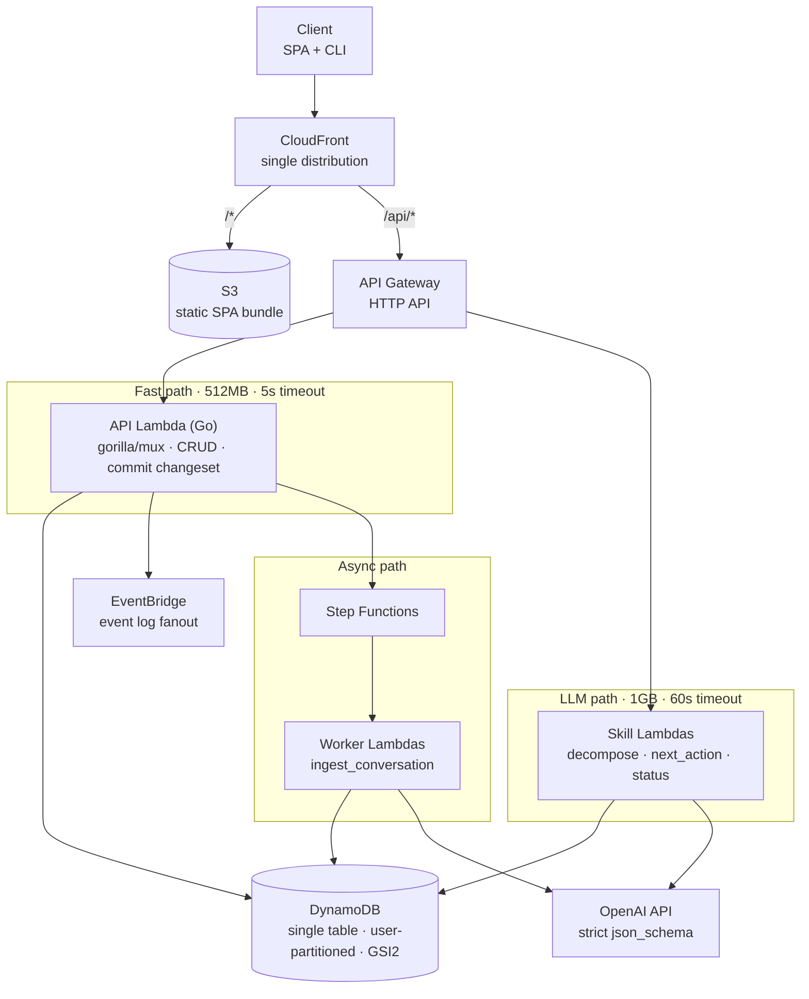
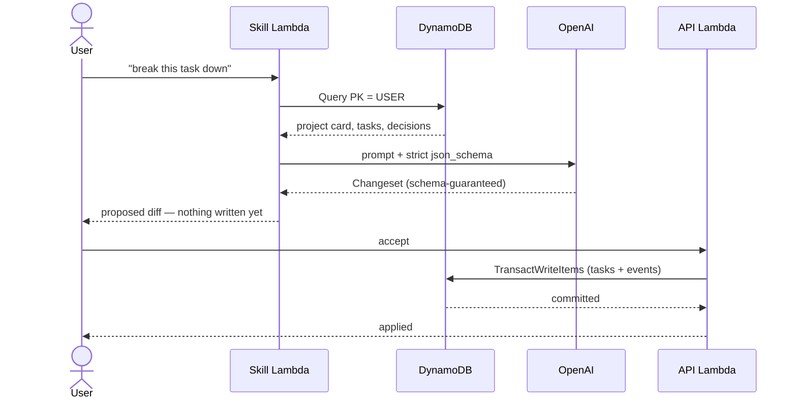

# Nudge — Architecture Decisions

**Product:** An assistant that helps indie developers actually ship things. Breaks big tasks into small ones, adds clarity, maintains context.

**Status:** Pre-implementation. Decisions below cover the POC and MVP.

---

## Architecture at a glance



Every compute node runs **outside the VPC** — DynamoDB over its public endpoint with IAM auth, OpenAI over the public internet. No NAT Gateway anywhere in this picture, which is deliberate (see §9).

The agent core — context assembler, skill router, changeset applier — is not a deployed component. It's shared Go packages compiled into whichever Lambda needs them.

---

## 1. Domain model

Five entities carry every use case.

| Entity | Purpose |
|---|---|
| `Project` | Goal, stack, constraints, status. The "project card" injected into every prompt. |
| `Task` | Tree-shaped via `parent_id`. Status, order, acceptance criteria. |
| `Decision` | An ADR: context, choice, rationale, date. |
| `Event` | Append-only log of everything that happened. |
| `Note` | Raw conversation material not yet turned into tasks or decisions. |

**Rationale:** All six use cases are reads or writes over these five. The `Event` log is what makes "update the project with the conversation" tractable and gives a project journal for free.

---

## 2. The LLM never writes to the datastore

Every skill returns a **proposed changeset** — "create these 5 subtasks, mark task 12 blocked, add this decision." The UI renders it as a reviewable diff. Only an explicit user accept commits it.

**Rationale:** Turns model non-determinism into a UI problem instead of a data-corruption problem. Gives trust, undo, and an audit trail as a side effect.



Note the two separate round trips. Proposal is a read-only operation on the LLM path; commit is a write on the fast path. That split is why the Lambdas divide the way they do in §11.

---

## 3. Hybrid determinism — code for facts, LLM for language

Two use cases are explicitly **not** pure LLM calls:

- **"Where are we?"** — compute counts, stale tasks, blocked tasks, days since activity in Go. Hand the model the computed summary and ask it to narrate. Same numbers every time.
- **"What should I do next?"** — compute the candidate set deterministically (unblocked, dependency-ordered, in-progress first), then let the model rank the top 5 and explain why. A ranking layer rejects any task the model invents.

---

## 4. Skills are a uniform abstraction

```go
type Skill interface {
    Name() string
    BuildContext(ctx context.Context, projectID string) (Context, error)
    ResponseFormat() openai.ResponseFormatJSONSchemaParam  // the changeset shape
    Tools() []openai.ChatCompletionToolParam              // context retrieval only
    Parse(raw json.RawMessage) (Changeset, error)
}
```

Note the split: the **output** shape is a `json_schema` response format, while **tools** are reserved for context retrieval (`get_task_tree`, `search_decisions`). Keeping those separate is cleaner than overloading tool calls to carry the result.

Six skills map to the six use cases: `create_project`, `decompose_task`, `project_status`, `next_action`, `log_decision`, `ingest_conversation`.

**Rationale:** Adding a seventh becomes one new file, not new plumbing.

---

## 5. Context assembly is tiered, not stuffed

- **Always injected:** project card, active tasks, last N decisions.
- **Exposed as tools:** `get_task_tree`, `search_decisions`, `get_task_history` — the model pulls what it needs.

**No vector search.** A project is a few hundred items; retrieval-as-tools is sufficient and simpler.

---

## 6. Platform: AWS + Go

Chosen for familiarity. Go is a good fit regardless — 50–100ms cold starts, small binaries, and structured outputs map cleanly onto typed structs.

### LLM provider: OpenAI

Access via the official `github.com/openai/openai-go`.

**Structured outputs via `response_format: { type: "json_schema", strict: true }`**, not tool use. Strict mode guarantees the response conforms to the schema, which is a stronger contract than validating tool arguments after the fact — the changeset either matches the struct or the call fails.

Generate the schema from Go structs with `invopop/jsonschema`, but **post-process it for strict mode**:

- `additionalProperties: false` on every object
- every property listed in `required` — no genuinely optional fields
- optionality is expressed as a nullable union (`["string", "null"]`), not by omission
- no `anyOf` at the schema root

Write that post-processing once as a helper; every skill reuses it.

**Prompt ordering matters for cost.** OpenAI caches prompt prefixes automatically for prompts over ~1024 tokens. Put the stable content first — system prompt, then the project card — and the variable content (the user's question, recently changed tasks) last. Since the project card goes into every single call, this is close to free savings if the ordering is right and worthless if it isn't.

Pick specific models at implementation time rather than fixing them here; use a small cheap model for routing and summarization and a larger one for decomposition and next-action ranking.

---

## 7. Datastore: DynamoDB, single table, GSIs only

**Decision:** Single-table DynamoDB. **Global** secondary indexes. **No LSIs.**

**Why not LSIs:** They must be defined at table creation and can never be added, removed, or altered. The schema will change several more times before it settles. GSIs are additive against a live table, which removes the premature-lock-in risk entirely.

**Why DynamoDB over Postgres:** A project is a *bounded working set* — a few hundred items, well under the 1MB Query page. A single `begins_with` Query on the user's partition pulls a whole project in one round trip, and all filtering, ranking, and aggregation happens in Go over an in-memory slice. That removes the two usual objections: no `GROUP BY` needed, and no materialized paths needed (re-parenting is a single `UpdateItem` on `parent_id`, since the tree is assembled in Go anyway).

It also fits Lambda better than anything else: no VPC, no connection pooling, no cold-resume, IAM auth instead of secrets, genuine per-request billing.

### Key schema

Partitioned by **user**, with the project ID carried in the sort key prefix.

| Item | PK | SK |
|---|---|---|
| Project card | `USER#<uid>` | `META#<pid>` |
| Task | `USER#<uid>` | `P#<pid>#TASK#<uuid>` |
| Decision | `USER#<uid>` | `P#<pid>#DEC#<ts>` |
| Event | `USER#<uid>` | `P#<pid>#EVT#<ts>` |
| Pending changeset | `USER#<uid>` | `P#<pid>#PENDING#<job_id>` |

| Access pattern | Query |
|---|---|
| List my projects | `PK = USER#<uid> AND begins_with(SK, "META#")` |
| Load one project | `PK = USER#<uid> AND begins_with(SK, "P#<pid>#")` |
| Cross-project next action | GSI2 |

**Authorization is structural, not procedural.** The partition key is derived from the verified JWT subject and never from user input, so a query is physically scoped to the caller's data. A handler that forgets an ownership check still cannot leak another user's project. This is a stronger guarantee than checking `owner_id` at the API layer, and it survives contributors — human or agent — who don't know the conventions.

**There is no GSI1.** Project listing was its only job and the base table now handles it. That removes an index every item projected into, cutting billed writes by roughly 25%.

**GSI2 (sparse):** `PK = USER#<uid>`, `SK = <priority>#<updated_at>`. Key attributes are written only when a task is actionable (unblocked, not done); marking a task blocked or done deletes them so it drops out of the index. Because it's user-partitioned, "what should I do next?" works **across all of a user's projects** in a single Query — which for a developer juggling several side projects is the more useful version of the feature.

### Scope decision: single-user projects only

**Every project has exactly one owner. Shared projects are explicitly out of scope for the MVP.**

This is a product decision, not a limitation to work around. Nudge is a *personal* project agent — the user is an indie developer working alone, and the whole design leans into that: user-partitioned keys, no membership model, no per-user assignment on tasks.

Do not build toward collaboration. No `MEMBER#` items, no `assignee_id` field, no permission checks beyond ownership. Speculative scaffolding for a feature that may never ship is cost without benefit, and it would dilute the structural authorization guarantee above.

**What it would cost later, honestly:** user partitioning makes sharing a re-key, not an addition. A second person's access would require duplicating items into their partition or reading across partitions, and ownership transfer would rewrite every item. That's a real migration. It's accepted knowingly, in exchange for authorization that can't be forgotten and one fewer index.

**Non-issue:** the 10GB item collection limit applies only to tables with local secondary indexes, which §7 already bans. DynamoDB will split large user partitions freely.

### Still add a `version` attribute

Single-user does **not** mean single-session. The propose/commit split means a changeset is generated against one read of project state and committed in a separate round trip, possibly minutes later while the user reviews the diff. Two browser tabs, or a phone and a laptop, produce exactly the conflict a multi-user system would.

- `version` (integer) on the project `META#<pid>` item, incremented on every commit.
- A proposed changeset records the version it was built against.
- The commit transaction carries `ConditionExpression: version = :expected`.
- On mismatch, the UI reports that the project changed and offers to re-propose.

One attribute and one condition expression. It costs nothing now and is unpleasant to retrofit once there's data.

### The one rule this creates

Build the PK from the **verified JWT claim only** — never from a path parameter, query string, or request body. A route like `/api/users/:uid/projects` reintroduces exactly the hole this design closes. Resolve the user ID once in middleware and pass it through `context.Context`.

### Constraints to respect

- Each GSI an item projects into is a **separate billed write**. Three indexes ≈ 3–4x write cost. Don't add indexes casually.
- `TransactWriteItems` caps at **100 items**. The changeset applier can exceed this on a large conversation ingestion — chunk it, and make chunks idempotent.

---

## 8. Store sits behind a `Repository` interface

Not because a swap is likely — because a Postgres implementation is ~100 lines and gives a local dev target that can be queried freely with psql while DynamoDB runs in staging.

---

## 9. Lambda stays outside the VPC

**Rationale:** A Lambda inside a VPC loses default internet access and can't reach `api.openai.com` without a NAT Gateway — roughly $32/month before serving a single request. DynamoDB is reached over its public endpoint with IAM auth, so no VPC is needed at all. This constraint is a large part of why DynamoDB wins over Aurora here.

---

## 10. No token streaming in the MVP

Response streaming only works on Lambda Function URLs, and the Go runtime has no first-class support — it means writing against the Runtime API directly.

**Not needed:** Nudge's outputs are structured changesets rendered as a reviewable diff, not chat prose. Return complete JSON, show a skeleton in the UI.

**If needed later:** add one Fargate service for that single endpoint rather than contorting the whole API.

---

## 11. Split Lambdas by resource profile, not per route

**Decision:** 3–4 functions total.

- **API Lambda** — 256–512MB, short timeout. All CRUD: create project, list tasks, apply an approved changeset, log a decision. Dozens of routes behind a `gorilla/mux` router via `awslabs/aws-lambda-go-api-proxy` (use its `gorillamux` adapter package, not the `chi` one). One binary, one warm pool.

Since `gorilla/mux` is a plain `net/http` router, local dev is `go run` against a normal `http.Server` — same handlers, same middleware, full debugger, no SAM local emulation. Only the thin `lambda.Start` wrapper differs between local and deployed.
- **LLM Lambdas** — 1GB, generous timeouts, own concurrency limits and IAM roles. Anything that calls OpenAI: `decompose`, `next_action`, `ingest`.

**Why not function-per-route:** The cold-start argument is a Node/Python/Java concern; Go binaries start fast regardless. Splitting also *fragments the warm pool* — twelve functions each get a trickle of traffic and each go cold independently. Plus: one atomic deploy, and local dev is a plain `go run` with a debugger attached.

**Why not a single lambdalith either:** A single function must be sized for its worst case, so every cheap Dynamo read gets billed at 1GB. And one slow LLM route saturating the concurrency pool would starve cheap reads. Resource profile is the real seam; the LLM boundary is where profiles diverge.

---

## 12. Long-running work goes to Step Functions

Conversation ingestion and large decompositions run as Step Functions workflows with worker Lambdas. Retries, timeouts, and state machine handling come free. EventBridge carries the event log; SQS carries work.

---

## 13. Infrastructure

- **API:** API Gateway HTTP API (not REST API — cheaper, simpler).
- **Runtime:** Lambda on `provided.al2023`.
- **IaC:** SAM or Terraform.

---

## 14. UI: static SPA on S3 + CloudFront

**Decision:** Client-rendered SPA (Vite), served from a private S3 bucket through CloudFront. No SSR anywhere.

**Rationale:** Nudge is an authenticated tool behind a login — no SEO, no public pages, nothing to pre-render. Every SSR option (Amplify SSR, OpenNext, Lambda@Edge) charges per request to solve a problem that doesn't exist here. Choosing static is the cost decision; the hosting service is a detail after that.

CloudFront's always-free tier is permanent, not a trial: 1 TB of data transfer out per month, 10M requests, 2M CloudFront Function invocations, free SSL certificates, all features available.

### Cost

| Item | Cost |
|---|---|
| CloudFront | $0 (always-free tier) |
| S3 storage (~25MB) | ~$0.001 |
| ACM certificate | $0 |
| Route 53 hosted zone | $0.50/mo |
| **Total** | **~$0.50/mo** |

The hosted zone is the only guaranteed recurring charge, and it's avoidable by pointing the registrar's DNS at CloudFront directly.

### One distribution, two origins

| Behavior | Origin | Config |
|---|---|---|
| `/*` (default) | S3 via Origin Access Control | Bucket stays private |
| `/api/*` | API Gateway | Caching **disabled**, `AllViewerExceptHostHeader` origin request policy |

**Why bother:** no CORS preflight (removes a round trip from every API call), cookies work as first-party without `SameSite=None`, and one domain to configure. The extra requests fall under the same free allowance.

### Config gotchas

- **Origin Access Control**, not a public bucket or the legacy OAI.
- **ACM cert must be issued in us-east-1** regardless of where the rest of the stack lives.
- **SPA routing:** CloudFront custom error responses mapping 403 and 404 → `/index.html` with status 200, or deep-link refreshes 404.
- **Cache headers:** hashed assets get `max-age=31536000, immutable`; `index.html` gets `no-cache`. Then deploys need no invalidation at all.
- **Deploy:** `aws s3 sync` from GitHub Actions. Invalidations are free for the first 1,000 paths/month; `/*` counts as one path.

### Rejected: Amplify Hosting

Convenient (git-push deploys, PR previews, no distribution config), but the pricing shape is wrong: free for 12 months, then $0.15/GB served, $0.01/build minute, $0.023/GB stored — with no always-free hosting tier underneath. Month 13 goes from $0 to per-gigabyte billing while CloudFront's 1 TB stays free indefinitely. Since SAM/Terraform is already in play for the backend, the distribution is ~60 lines in the same template.

---

## 15. Auth: GitHub OAuth, self-issued JWTs

**Decision:** GitHub is the only identity provider. Nudge issues its own tokens. The CLI is a first-class client.

**Rationale:** The target user is an indie software developer — GitHub coverage is effectively 100%. No password, no email verification, no reset flow, no MFA to build. Free permanently with no MAU tier and no vendor to migrate off. And the token is useful to the product later: commits, PRs, and issues are the raw material for auto-updating project state.

**Rejected:** Cognito (10,000 MAU free but poor DX and confusing tier changes), WorkOS AuthKit (1M MAU free, genuinely good, but adds a vendor for a managed layer we barely use), Clerk (its value is prebuilt React components, and our login is one button), Auth0 (fine free tier, expensive past it).

**Google was the close call.** Same cost, same coverage. Two things decided it: Google's loopback flow needs a browser on the same machine, so a CLI over SSH or in a container breaks, while GitHub's device flow works anywhere. And GitHub's token unlocks repo context; Google's equivalent is Calendar, which needs sensitive scopes and OAuth verification review.

### Flows

| Client | Flow |
|---|---|
| Web SPA | Authorization code + PKCE, redirect to `/api/auth/callback` |
| CLI | Device flow (RFC 8628) — print code, user approves in browser, poll for token |

### Tokens

- **Access token:** self-issued JWT, HS256, 15-minute expiry. Signing secret in SSM Parameter Store. Carries the internal user ID as `sub`.
- **Refresh token:** opaque random string, stored **hashed** in DynamoDB with a TTL attribute. DynamoDB TTL expires sessions at no cost, and storing the hash means a table leak doesn't yield usable sessions. This is also what makes revocation possible.
- **Transport:** `Authorization: Bearer <access_token>` for both clients — one uniform middleware path.
- **Refresh token storage:** web keeps it in an httpOnly, Secure, SameSite=Strict cookie (first-party, which is exactly what §14's single-distribution setup buys); the CLI keeps it in `~/.nudge/credentials` at mode 0600.

The GitHub access token itself is **never** sent to the client. It's stored server-side against the user record for future repo integration.

### Identity is decoupled from the provider

The internal user ID is a generated UUID, **not** the GitHub user ID. Since the DynamoDB partition key is derived from it (§7), coupling it to a provider would make adding a second provider a full re-key.

| Item | PK | SK | Purpose |
|---|---|---|---|
| User profile | `USER#<uid>` | `PROFILE` | Internal identity, GitHub token |
| Identity lookup | `IDENTITY#github#<gh_id>` | `IDENTITY` | Login: GitHub ID → internal UID |
| Session | `USER#<uid>` | `SESSION#<sha256(refresh)>` | Refresh token, TTL attribute |

Login is a single `GetItem` on the identity item — **no GSI needed**, which keeps write costs down (§7). Adding Google later means writing `IDENTITY#google#<sub>` pointing at the same UID; linking by verified email becomes possible rather than a migration.

### Validation

Token validation is Go middleware in the API Lambda, not an API Gateway JWT authorizer. The native authorizer requires an OIDC discovery endpoint, which self-issued tokens don't have, and hosting one to save a few milliseconds isn't worth it. Middleware resolves the user ID once and puts it in `context.Context` — which is the mechanism §7's authorization guarantee depends on.

---

## POC scope

Deliberately none of the above.

One `main.go`, `lambda.Start`, a Function URL, no datastore, one skill (`decompose_task`).

The original plan was a discriminated union at the root, but **strict mode disallows `anyOf` at the schema root**. Model it as a single object with nullable branches instead, and discriminate on `status` in Go:

```json
{
  "status": "ok" | "needs_clarification",
  "subtasks": [...] | null,
  "questions": [...] | null
}
```

Both fields stay in `required`; the unused one is explicitly `null`. This pattern will recur across every skill, so settle it here.

**The only goal is to find out whether the `Task` struct has the right fields.** Everything else gets built once that answer stops changing.

---

## MVP build order

1. Persistence + the project card
2. `project_status` and `next_action` — deterministic-first, so they're trustworthy immediately
3. `log_decision`
4. `ingest_conversation` — last, since it's the fuzziest and benefits from the rest existing

---

## Open questions

### Blocking — decide before writing code

- **What is `priority`?** GSI2's sort key is `<priority>#<updated_at>` and nothing defines what produces that value. User-set? Computed from dependencies and staleness? A bucketed enum? The sort key format is fixed at index creation, so this is a schema-level unknown.
- **Secrets storage.** SSM Parameter Store (free standard tier) vs Secrets Manager (~$0.40/secret/month). Three secrets to hold: OpenAI key, GitHub client secret, JWT signing secret. Parameter Store is the likely answer given the cost constraint (§14).

### Decide during the build

- **Optimistic concurrency (`version` on project META).** A changeset is proposed against a read and committed minutes later. Even single-user, two tabs or a concurrent async job produce stale commits. One attribute plus a `ConditionExpression`. Retrofitting is a data migration.
- **Pending changeset persistence.** `P#<pid>#PENDING#<job_id>` appears in the §7 schema because the async path needs it. Whether the sync path also uses it (survives refresh) or keeps proposals in client state is undecided.
- **Async job status and notification.** Polling is the answer given no streaming (§10), but interval, job-status item shape, and failure handling are unspecified.
- **Idempotency keys for changeset commits.** Chunked commits must be idempotent; the key derivation isn't defined. Client-supplied, or a deterministic hash of the changeset?
- **Project deletion.** Removing every `P#<pid>#` item exceeds the 100-item `TransactWriteItems` cap on any real project. Needs a soft-delete flag or a paginated background job.

### Can wait

- **SAM vs Terraform** for `/infra`.
- **What consumes EventBridge.** It carries "event log fanout" in the topology diagram but nothing subscribes. The `EVT#` items in DynamoDB already are the event log — this may be premature.
- **Per-user OpenAI spend limits.** Not urgent at MVP scale, but a cost-sensitive multi-user product eventually needs a ceiling per account.
- **Model selection.** Deliberately deferred to implementation time.

### Resolved

- ~~Auth provider~~ → GitHub OAuth, self-issued JWTs (§15)
- ~~Is the CLI first-class?~~ → Yes. Device flow, Bearer tokens (§15)
- ~~Cost trigger for revisiting the datastore~~ → Obsolete; DynamoDB is the cheap option (§7)
